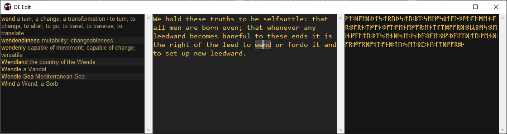

<p align="center">
  
  <h2 align="center">Old English / Anglish text editor</h2>
</p>



([Text source](https://anglish.miraheze.org/wiki/Younger_Futhorc))

* Realtime wordbook query<br>(Fetched [hence](https://docs.google.com/spreadsheets/d/1y8_11RDvuCRyUK_MXj5K7ZjccgCUDapsPDI5PjaEkMw) at runtime.)
* Minimalist look
* Latinized/runic output<br>(Runes require [espeak](http://espeak.sourceforge.net/).)


Install from command-line: `python -m pip install git+https://github.com/kovadarra/oe-edit.git`<br>**Note**: `pywin32` may not install properly, in which situation it can be downloaded [hence](https://github.com/mhammond/pywin32/releases).

Run from command-line: `python -m oe_edit`

```
Welcome to OE Edit! This is an experimental text editor that's meant to streamline the writing of Old English texts. For IPA transliteration, external program is needed:
  http://espeak.sourceforge.net/

Shortcuts
  Ctrl+C          Copy selected text
  Ctrl+X          Copy and delete selected text
  Ctrl+V          Paste copied text
  Ctrl+A          Select all text
  Ctrl+Z          Undo (file switch clears history)

  Ctrl+Left       Previous non-whitespace chunk begin
  Ctrl+Right      Next non-whitespace chunk begin
  Home            Beginning of line
  Ctrl+Home       Beginning of file
  End             End of line
  Ctrl+End        End of file
  Shift+<Motion>  Select from cursor to move location

  Ctrl+N          New file
  Ctrl+Tab,       Next file
  Ctrl+PgDn
  Ctrl+Shift+Tab, Previous file
  Ctrl+PgUp
  Ctrl+W,         Delete file
  Ctrl+F4

  Ctrl+Shift+C    Make a Google doc-friendly copy
  Ctrl+Shift+T    Transcribe to runic script
  Ctrl+Space      Apply suggested wordbook entry

Latinized rendition character conversion rules
  ää->ǣ th->þ  ä->æ yy->ȳ ee->ē oo->ō cc->ċ aa->ā
  ii->ī uu->ū gG->g  g->ġ  w->ƿ tH->ð gh->ȝ Ää->Ǣ
  Th->Þ  Ä->Æ Yy->Ȳ Ee->Ē Oo->Ō Cc->Ċ Aa->Ā Ii->Ī
  Uu->Ū GG->G  G->Ġ  W->Ƿ TH->Ð Gh->Ȝ

Runic rendition character conversion rules
  eɪ.ɪŋ->ᛖᛁᛝ  eɪɪŋ->ᛖᛁᛝ  eɪ.ɝ->ᛖᛁᚱ   eɪɚ->ᛖᛁᚱ
    eɪr->ᛖᛁᚱ   eɪɹ->ᛖᛁᚱ   eɪŋ->ᚫᛝ    i.ɝ->ᛠᚱ
     ɪɹ->ᛁᚱ     ɪr->ᛁᚱ     oʊ->ᚩ      əʊ->ᚩ
     tʃ->ᚳ      ks->ᛉ      ɡz->ᛉ      gz->ᛉ
     ŋg->ᛝ      ŋɡ->ᛝ      ɔɪ->ᚩᛁ     dʒ->ᚳᚷ
     ɪɝ->ᛁᚱ     eɪ->ᛖᛁ     ɛi->ᛖᛁ     aɪ->ᚪᛁ
     əɪ->ᚪᛁ     aʊ->ᚫᚢ     ɛɝ->ᚫᚱ     ɛɹ->ᚫᚱ
     ɛr->ᚫᚱ     æŋ->ᚫᛝ      f->ᚠ       v->ᚠ
      u->ᚢ       ʊ->ᚢ       ɵ->ᚢ       θ->ᚦ
      ð->ᚦ      ɹ̩->ᛖᚱ      ɹ->ᚱ       r->ᚱ
      j->ᛡ       g->ᚸ       ɡ->ᚸ       w->ᚹ
      h->ᚻ       n->ᚾ       ɪ->ᛁ       x->ᛇ
      p->ᛈ       s->ᛋ       z->ᛋ       t->ᛏ
      b->ᛒ       ɛ->ᛖ       e->ᛖ       m->ᛗ
      l->ᛚ       ŋ->ᛝ       d->ᛞ       ʌ->ᛟ
      ɒ->ᚪ       ɑ->ᚪ       ə->ᚪ       ɐ->ᚪ
      o->ᚩ       æ->ᚫ       a->ᚫ       i->ᛠ
      y->ᚣ       k->ᛣ       ʒ->ᚳᚷ      ʍ->ᚻᚹ
      ʃ->ᛋᚳ      ɝ->ᛖᚱ      ɜ->ᛖᚱ     ɔː->ᚪ
      ɔ->ᚪᚢ      ɚ->ᚪᚱ      ɾ->ᛏ

Recognized markup
  One can use the notation $r<a:b> to change the output based on whether runic (a) or latinized (b) output is being generated.

  The notation *expression* is on gdoc-copy turned to red and the asterisks are removed.
```
